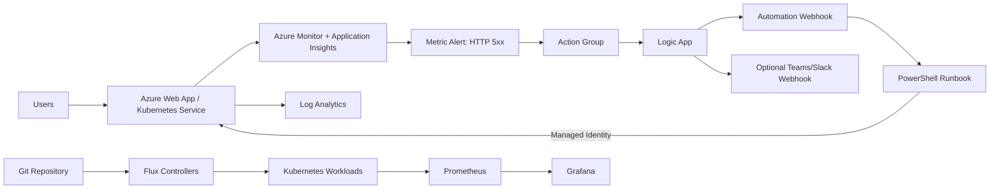

# Azure Self-Healing SRE Platform

A portfolio-grade DevOps/SRE project that detects application failures, routes Azure Monitor alerts through a Logic App, invokes an Azure Automation PowerShell runbook, restarts an unhealthy Azure Web App, and optionally notifies an operations channel.

The repository also includes a dependency-free Python service, Kubernetes deployment manifests, Flux GitOps definitions, Prometheus/Grafana integration, Jenkins and GitHub Actions pipelines, and an optional AI-assisted incident-summary utility.

## What this demonstrates

- Azure Monitor, Log Analytics, Application Insights and common alert schema
- Terraform-based Infrastructure as Code
- Logic Apps orchestration and Azure Automation PowerShell remediation
- Managed identity and least-privilege RBAC
- Kubernetes health probes, HPA and Prometheus ServiceMonitor
- Flux-based GitOps reconciliation
- Jenkins and GitHub Actions CI pipelines
- Incident-response automation and AI-assisted alert summarization

## Architecture



## Repository structure

```text
.
├── app/                         # Dependency-free Python demo API
├── automation/                  # PowerShell self-healing runbook
├── terraform/                   # Azure monitoring and remediation IaC
├── k8s/base/                    # Kubernetes deployment, service, HPA, ServiceMonitor
├── clusters/dev/                # Flux GitOps and monitoring definitions
├── scripts/                     # AI-assisted incident summary tool
├── samples/                     # Azure common alert schema example
├── .github/workflows/           # GitHub Actions CI
└── Jenkinsfile                  # Jenkins CI pipeline
```

## Prerequisites

- An Azure subscription
- An existing Azure Web App to monitor and restart
- Azure CLI authenticated with `az login`
- Terraform 1.8 or newer
- Permission to create resource groups, monitoring resources, Automation resources, Logic Apps and role assignments
- Optional: Docker, Kubernetes, Flux CLI, Jenkins

## 1. Run the demo service locally

```bash
cd app
python app.py
```

Open:

- `http://localhost:8080/health`
- `http://localhost:8080/ready`
- `http://localhost:8080/metrics`
- `http://localhost:8080/fail` to generate an HTTP 500 response

Run tests:

```bash
python -m unittest discover -s tests -v
```

## 2. Build the container

```bash
docker build -t azure-self-healing-demo:local ./app
docker run --rm -p 8080:8080 azure-self-healing-demo:local
```

## 3. Deploy the Azure self-healing framework

Copy and edit the example variables:

```bash
cd terraform
cp terraform.tfvars.example terraform.tfvars
```

Initialize and review:

```bash
terraform init
terraform fmt -check
terraform validate
terraform plan
terraform apply
```

The Terraform deployment creates:

- Log Analytics workspace
- Application Insights resource
- Diagnostic settings for the target Web App
- Azure Automation account with system-assigned managed identity
- PowerShell 7.2 remediation runbook and webhook
- Logic App HTTP trigger and remediation action
- Azure Monitor action group using the common alert schema
- HTTP 5xx metric alert
- Website Contributor role assignment scoped to the target Web App

> Security note: Azure Automation webhook URLs are secrets and are stored in Terraform state. Protect the state backend, use encryption and access controls, and rotate the webhook if it is exposed.

## 4. Connect Application Insights to the application

Terraform outputs an Application Insights connection string. Add it to the monitored application's configuration as `APPLICATIONINSIGHTS_CONNECTION_STRING`, or integrate the relevant Application Insights SDK/agent.

## 5. Test the self-healing flow

1. Generate enough HTTP 5xx responses to exceed the configured threshold.
2. Confirm the Azure Monitor metric alert fires.
3. Confirm the action group invokes the Logic App.
4. Confirm the Logic App invokes the Automation webhook.
5. Review the runbook job output and verify the Web App restart operation.
6. Confirm the alert resolves after the service becomes healthy.

For a safe first test, temporarily lower `http_5xx_threshold` in `terraform.tfvars`.

## 6. Kubernetes deployment

Update the image in `k8s/base/deployment.yaml`, then apply it directly:

```bash
kubectl apply -k k8s/base
```

The workload includes:

- Liveness and readiness probes
- CPU and memory requests/limits
- Horizontal Pod Autoscaler
- Prometheus-compatible `/metrics` endpoint
- ServiceMonitor for Prometheus Operator

## 7. Flux GitOps deployment

The development Flux source is already configured for `Arnolddennis/azure-self-healing-sre-platform`.

```bash
kubectl apply -f clusters/dev/monitoring.yaml
kubectl apply -f clusters/dev/apps.yaml
```

Flux reconciles the Kubernetes manifests from `k8s/base` and installs the Prometheus/Grafana stack through Helm.

## 8. AI-assisted incident summary

Create a deterministic summary from an Azure Monitor common-alert payload:

```bash
python scripts/ai_incident_summary.py samples/common-alert-schema.json
```

For an optional OpenAI-compatible API summary, set:

```bash
export AI_API_URL="https://your-endpoint.example/v1"
export AI_API_KEY="replace-me"
export AI_MODEL="your-model-name"
python scripts/ai_incident_summary.py samples/common-alert-schema.json --use-ai
```

The script never requires AI to produce a useful output; without API settings it provides a structured local incident summary and response checklist.

## CI/CD

### GitHub Actions

The workflow performs:

- Python unit tests
- Docker build
- Kubernetes YAML parsing
- Terraform formatting, initialization and validation

### Jenkins

The `Jenkinsfile` provides equivalent test, build and validation stages for a Jenkins agent with Docker and Terraform available.

## Resume-ready project description

**Azure Self-Healing Monitoring Framework** | Azure Monitor, Log Analytics, Application Insights, Terraform, Logic Apps, PowerShell, Kubernetes, Flux, Prometheus, Grafana, Jenkins

- Designed an event-driven monitoring and remediation framework that routes Azure Monitor alerts through a Logic App to a managed-identity PowerShell runbook, automatically restarting unhealthy application services.
- Implemented Infrastructure as Code, least-privilege RBAC, diagnostic logging, common alert schema processing and optional operations-channel notifications.
- Added Kubernetes health checks, autoscaling, Flux GitOps reconciliation, Prometheus/Grafana observability and CI validation using Jenkins and GitHub Actions.
- Developed an optional AI-assisted incident-summary utility to accelerate triage while preserving a deterministic non-AI fallback.

## Production improvements

For production use, consider:

- Remote Terraform state in Azure Storage with locking and restricted access
- Private endpoints and network restrictions for monitoring/automation services
- Azure Key Vault for secrets and webhook rotation
- Remediation cooldowns and retry limits to prevent restart loops
- Deployment slots, canary releases and automated rollback
- SLO-based alerting and alert deduplication
- Change-management approval for high-risk remediation actions
- Runbook job telemetry, dashboards and audit retention

## References

- Azure Monitor common alert schema: https://learn.microsoft.com/azure/azure-monitor/alerts/alerts-common-schema
- Logic Apps for Azure Monitor alerts: https://learn.microsoft.com/azure/azure-monitor/alerts/alerts-logic-apps
- Azure Automation managed identity runbooks: https://learn.microsoft.com/azure/automation/learn/powershell-runbook-managed-identity
- Terraform AzureRM provider: https://registry.terraform.io/providers/hashicorp/azurerm/latest/docs
- Flux documentation: https://fluxcd.io/flux/

## License

MIT
